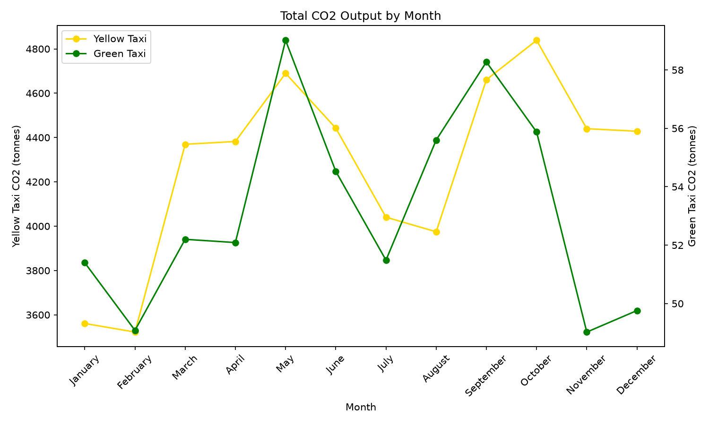

# DS3022 - Data Project - NYC Taxi CO2 Emissions 

## Project Overview

Using the freely available NYC Trip Record data, CO2 output for rides within 2024 were calculated and statistical
analysis was performed based on transformations added to the data.

## Data 

The data for this project is available from the NYC Taxi Commission Trip Record Data page:
**https://www.nyc.gov/site/tlc/about/tlc-trip-record-data.page**

## What the Pipeline Does

This project creates a data pipeline to analyze CO2 emissions from 2024 NYC Yellow and Green taxi trips. The pipeline loads the taxi and vehicle emissions data into DuckDB, cleans invalid trip records, creates new variables for analysis, and analyzes CO2 emissions across different time periods.

The pipeline consists of four Python files:

- `load.py` loads the 2024 Yellow and Green taxi data and the vehicle emissions data into DuckDB.
- `clean.py` removes duplicate and invalid trips, including trips with zero passengers, zero miles, distances over 100 miles, and durations over 86,400 seconds.
- `transform.py` calculates trip CO2 emissions and average speed and creates hour, day, week, and month variables.
- `analysis.py` analyzes CO2 emissions by hour, day, week, and month and creates a monthly CO2 emissions plot comparing Yellow and Green taxis.

## How to Run the Pipeline

Run the files in this order:

- python load.py
- python clean.py
- python transform.py
- python analysis.py

The final analysis creates co2_by_month.png, which shows the monthly CO2 totals for Yellow and Green taxis. Furthermore, all four files 
create separate log files.

## Design Decisions 

I used DuckDB to store and query the taxi data as the dataset contains millions of trips and SQL makes it easier to analyze the data.
During the loading stage, I selected only the columns needed for the rest of the pipeline instead of loading unnecessary columns.
For the transformation stage, I used the vehicle emissions lookup table to determine the CO2 emissions rate for each taxi type. Trip CO2 emissions were calculated using trip distance and the corresponding emissions rate.
For the analysis, I created a reusable function to calculate the most and least carbon-heavy hour, day, week, and month as it avoids excessive repeats.
For the monthly CO2 plot, I used separate y-axes for Yellow and Green taxis as Yellow taxi emissions had higher values than Green taxi emissions and using separate scales makes both trends visible on the same graph.

## Analyze

1. What was the single largest carbon producing trip of the year for YELLOW and GREEN trips? (One result for each type)
The largest single carbon-producing YELLOW trip produced 37.95 kg of CO2 and travelled 99.86 miles, with a pickup time of 2024-10-27 at 01:28:18. The largest single carbon-producing GREEN trip produced 34.75 kg of CO2 and travelled 99.28 miles, with a pickup time of 2024-02-28 at 11:11:12.

2. Across the entire year, what on average are the most carbon heavy and carbon light hours of the day for YELLOW and for GREEN trips? (1-24) 
For YELLOW trips, the most carbon heavy hour was hour 5, averaging 2.320 kg CO2 per trip, while the lightest was hour 18 averaging 1.142 kg CO2 per trip. For GREEN trips, the most carbon heavy hour was hour 5, averaging 1.597 kg CO2 per trip, while the lightest was hour 18 averaging 0.918 kg CO2 per trip.

3. Across the entire year, what on average are the most carbon heavy and carbon light days of the week for YELLOW and for GREEN trips? (Sun-Sat) 
For YELLOW trips, the most carbon heavy day Sunday, averaging 1.462 kg CO2 per trip, while the lightest was hour Saturday averaging 1.219 kg CO2 per trip. For GREEN trips, the most carbon heavy day was Sunday, averaging 1.121 kg CO2 per trip, while the lightest was Tuesday averaging 1.004 kg CO2 per trip.

4. Across the entire year, what on average are the most carbon heavy and carbon light weeks of the year for YELLOW and for GREEN trips? (1-52) 
For YELLOW trips, week 35 was the most carbon heavy, averaging 1.474 kg CO2 per trip, while week 51 was the lightest at 1.170 CO2 kg per trip. For GREEN trips, week 35 was the most carbon heavy, averaging 1.394 kg CO2 per trip, while week 3 was the lightest at 0.944 CO2 kg per trip.

5. Across the entire year, what on average are the most carbon heavy and carbon light months of the year for YELLOW and for GREEN trips? (Jan-Dec) 
For YELLOW trips, August was the most carbon heavy month, averaging 1.396 kg CO2 per trip, while February was the lightest at 1.226 CO2 kg per trip. For GREEN trips, August was the most carbon heavy month, averaging 1.147 kg CO2 per trip, while January was the lightest at 0.969 CO2 kg per trip.

6. Use a plotting library of your choice (`matplotlib`, `seaborn`, etc.) to generate a time-series plot or histogram with MONTH
along the X-axis and CO2 totals along the Y-axis. Render two lines/bars/plots of data, one each for YELLOW and GREEN taxi trip CO2 totals.

